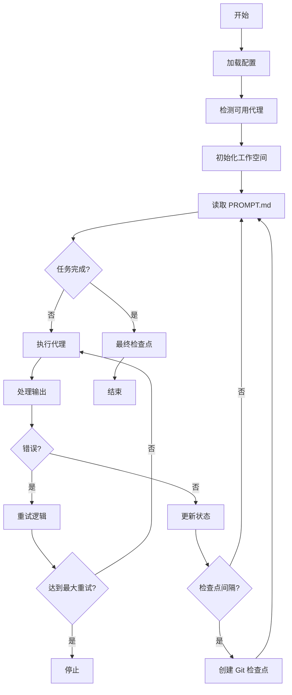

# 系统架构

## 概述

Ralph Orchestrator 实现了一个简单而有效的架构,基于 Ralph Wiggum 技术——一种连续循环模式,运行 AI 代理直到任务完成。

## 核心组件

### 1. 编排引擎

Ralph 的核心是 `ralph_orchestrator.py` 中的编排循环:

```python
while not task_complete:
    execute_agent()
    check_completion()
    handle_errors()
    checkpoint_if_needed()
```

### 2. 代理抽象层

Ralph 通过统一接口支持多个 AI 代理:

- **Claude** (Anthropic Claude Code CLI)
- **Q Chat** (Q CLI tool)
- **Gemini** (Google Gemini CLI)

每个代理都通过子进程调用执行,具有一致的错误处理和输出捕获。

### 3. 状态管理

```
.agent/
├── metrics/        # 性能和状态数据
├── checkpoints/    # Git 检查点标记
├── prompts/        # 存档的提示词历史
└── plans/          # 代理规划文档
```

### 4. Git 集成

Ralph 使用 Git 进行:
- **检查点**: 定期提交以便恢复
- **历史**: 跟踪代码演变
- **回滚**: 重置到最后已知的好状态

## 系统流程



## 设计原则

### 1. 简单胜于复杂
- 核心编排器约 400 行 Python 代码
- 除了 AI CLI 工具外无外部依赖
- 清晰、可读的代码结构

### 2. 故障安全操作
- 指数退避的自动重试
- 故障间的状态持久化
- 用于恢复的 Git 检查点

### 3. 代理无关
- 所有 AI 代理的统一接口
- 自动检测可用工具
- 代理不可用时的优雅降级

### 4. 可观察行为
- 全面的日志记录
- 指标收集
- 状态检查工具

## 目录结构

```
ralph-orchestrator/
├── ralph_orchestrator.py     # 核心编排引擎
├── ralph                     # Bash 包装脚本
├── PROMPT.md                # 用户任务定义
├── .agent/                  # Ralph 工作空间
│   ├── metrics/            # JSON 状态文件
│   │   └── state_*.json
│   ├── checkpoints/        # Git 检查点标记
│   │   └── checkpoint_*.txt
│   ├── prompts/            # 存档的提示词
│   │   └── prompt_*.md
│   └── plans/              # 规划文档
│       └── *.md
└── test_comprehensive.py    # 测试套件
```

## 关键类和函数

### RalphOrchestrator 类

```python
class RalphOrchestrator:
    def __init__(self, config: Dict):
        """使用配置初始化编排器"""

    def run(self) -> Dict:
        """主编排循环"""

    def execute_agent(self, agent: str, prompt: str) -> Tuple:
        """使用提示词执行 AI 代理"""

    def check_task_complete(self, prompt_file: str) -> bool:
        """检查任务是否标记为完成"""

    def create_checkpoint(self, iteration: int):
        """创建 Git 检查点"""

    def save_state(self):
        """持久化当前状态到磁盘"""
```

### 代理执行

```python
def execute_agent(agent: str, prompt: str) -> Tuple[bool, str]:
    """执行 AI 代理并捕获输出"""
    cmd = [agent, prompt]
    result = subprocess.run(
        cmd,
        capture_output=True,
        text=True,
        timeout=300
    )
    return result.returncode == 0, result.stdout
```

## 错误处理

### 重试策略
1. 初始尝试
2. 指数退避 (2, 4, 8, 16 秒)
3. 最多 5 次连续失败
4. 尝试之间保留状态

### 恢复机制
- Git 重置到最后检查点
- 手动干预点
- 状态文件分析工具

## 性能考虑

### 资源使用
- 最小内存占用 (~50MB)
- CPU 受 AI 代理执行限制
- 用于状态持久化的磁盘 I/O

### 可扩展性
- 单任务执行(设计如此)
- 通过多个实例并行执行
- 实例间无共享状态

## 安全

### 进程隔离
- AI 代理在子进程中运行
- 无直接代码执行
- 沙盒化文件系统访问

### Git 安全
- 无强制推送
- 仅检查点提交
- 保留用户提交

## 监控

### 指标收集
```json
{
  "iteration_count": 15,
  "runtime": 234.5,
  "agent": "claude",
  "errors": [],
  "checkpoints": [5, 10, 15]
}
```

### 健康检查
- 代理可用性检测
- 提示词文件验证
- Git 仓库状态

## 未来架构考虑

### 潜在增强
1. **插件系统**: 动态代理加载
2. **Web 界面**: 基于浏览器的监控
3. **分布式执行**: 任务并行化
4. **云集成**: 远程执行支持

### 保持简单
任何架构更改应该:
- 保持核心循环的简单性
- 维持 "unpossible" 哲学
- 保持依赖最小化
- 确保确定性行为
