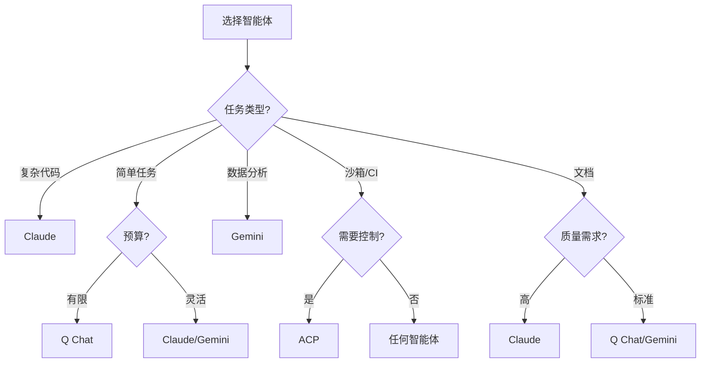

# AI 智能体指南

Ralph Orchestrator 支持多种 AI 智能体,每种都具有独特的能力和成本结构。本指南帮助您为任务选择和配置合适的智能体。

## 支持的智能体

### Claude (Anthropic)

Claude 是 Anthropic 的先进 AI 助手,以细腻的理解和高质量输出著称。

**优势:**
- 优秀的代码生成和调试能力
- 强大的推理和分析能力
- 全面的文档编写能力
- 符合伦理和安全性的响应
- 大上下文窗口(200K tokens)

**适用于:**
- 复杂的软件开发
- 技术文档编写
- 研究和分析
- 创意写作
- 需要深度推理的问题解决

**安装:**
```bash
npm install -g @anthropic-ai/claude-cli
```

**使用:**
```bash
python ralph_orchestrator.py --agent claude
```

**成本:**
- 输入:每百万 tokens $3.00
- 输出:每百万 tokens $15.00

### Q Chat

Q Chat 是一款经济高效的 AI 助手,适用于许多通用任务,现已具备生产就绪的适配器实现。

**优势:**
- 良好的通用能力
- 快速响应时间,支持流式输出
- 简单任务成本效益高
- 直接操作可靠
- 线程安全的并发消息处理
- 强大的错误处理和恢复能力
- 优雅关闭和资源清理

**适用于:**
- 简单的编码任务
- 基础文档编写
- 数据处理
- 快速原型开发
- 预算敏感的操作
- 高并发工作负载
- 长时间运行的批处理

**安装:**
```bash
pip install q-cli
```

**使用:**
```bash
python ralph_orchestrator.py --agent q

# 简写形式
python ralph_orchestrator.py -a q
```

**生产特性:**
- **消息队列**:线程安全的异步消息处理
- **错误恢复**:指数退避自动重试
- **信号处理**:SIGINT/SIGTERM 优雅关闭
- **资源管理**:正确清理进程和线程
- **超时处理**:可配置超时,保留部分输出
- **非阻塞 I/O**:防止管道通信死锁
- **并发处理**:同时处理多个请求

**成本:**
- 输入:每百万 tokens $0.50(估算)
- 输出:每百万 tokens $1.50(估算)

### Gemini (Google)

Google 的 Gemini 提供强大的能力和多模态理解。

**优势:**
- 擅长数据分析
- 强大的数学能力
- 良好的代码理解
- 多模态能力(Pro 版本)
- 有竞争力的定价

**适用于:**
- 数据科学任务
- 数学计算
- 代码分析
- 研究任务
- 多语言支持

**安装:**
```bash
pip install google-generativeai
```

**使用:**
```bash
python ralph_orchestrator.py --agent gemini
```

**成本:**
- 输入:每百万 tokens $0.50
- 输出:每百万 tokens $1.50

### ACP (Agent Client Protocol)

ACP 能够与任何实现[Agent Client Protocol](https://github.com/anthropics/agent-client-protocol)的智能体集成。这提供了一种与 AI 智能体通信的标准化方式,无论其底层实现如何。

**优势:**
- 适用于任何符合 ACP 的智能体
- 标准化的 JSON-RPC 2.0 协议
- 灵活的权限处理(4 种模式)
- 支持文件和终端操作
- 通过 scratchpad 实现会话持久化
- 支持流式更新

**适用于:**
- 使用多个智能体后端
- 自定义智能体实现
- 沙箱执行环境
- 具有受控权限的 CI/CD 流水线
- 具有安全要求的企业部署

**安装:**
```bash
# 支持 ACP 的 Gemini CLI
npm install -g @google/gemini-cli

# 任何其他符合 ACP 的智能体
# 按照智能体的安装说明操作
```

**使用:**
```bash
# 使用 Gemini 的基本 ACP 用法
python ralph_orchestrator.py --agent acp --acp-agent gemini

# 使用特定权限模式
python ralph_orchestrator.py --agent acp --acp-agent gemini --acp-permission-mode auto_approve

# 使用允许列表模式
python ralph_orchestrator.py --agent acp --acp-permission-mode allowlist
```

**权限模式:**

| 模式 | 描述 | 使用场景 |
|------|-------------|----------|
| `auto_approve` | 自动批准所有请求 | 受信任的环境、CI/CD |
| `deny_all` | 拒绝所有权限请求 | 测试、沙箱执行 |
| `allowlist` | 仅批准匹配的模式 | 使用特定工具的生产环境 |
| `interactive` | 提示用户批准每个请求 | 开发、手动监督 |

**配置 (ralph.yml):**
```yaml
adapters:
  acp:
    enabled: true
    timeout: 300
    tool_permissions:
      agent_command: gemini
      agent_args: []
      permission_mode: auto_approve
      permission_allowlist:
        - "fs/read_text_file:*.py"
        - "fs/write_text_file:src/*"
        - "terminal/create:pytest*"
```

**环境变量:**
```bash
export RALPH_ACP_AGENT=gemini
export RALPH_ACP_PERMISSION_MODE=auto_approve
export RALPH_ACP_TIMEOUT=300
```

**支持的操作:**

| 操作 | 描述 |
|-----------|-------------|
| `fs/read_text_file` | 读取文件内容(带路径安全) |
| `fs/write_text_file` | 写入文件内容(带路径安全) |
| `terminal/create` | 使用命令创建子进程 |
| `terminal/output` | 读取进程输出 |
| `terminal/wait_for_exit` | 等待进程完成 |
| `terminal/kill` | 终止进程 |
| `terminal/release` | 释放终端资源 |

**成本:**
- 输入:$0.00(由底层智能体处理计费)
- 输出:$0.00(由底层智能体处理计费)

**注意:** Claude CLI 目前不支持原生 ACP 模式。对于 Claude,请使用原生 `ClaudeAdapter`(`--agent claude`)。

## 自动检测

Ralph Orchestrator 可以自动检测并使用可用的智能体:

```bash
python ralph_orchestrator.py --agent auto
```

**检测顺序:**
1. Claude(如果已安装)
2. Q Chat(如果已安装)
3. Gemini(如果已安装)

## 智能体比较

| 特性 | Claude | Q Chat | Gemini | ACP |
|---------|--------|--------|---------|-----|
| **上下文窗口** | 200K | 100K | 128K | 可变 |
| **代码质量** | 优秀 | 良好 | 很好 | 可变 |
| **文档** | 优秀 | 良好 | 良好 | 可变 |
| **速度** | 中等 | 快 | 快 | 可变 |
| **成本** | 高 | 低 | 低 | 取决于智能体 |
| **推理** | 优秀 | 良好 | 很好 | 可变 |
| **创造力** | 优秀 | 良好 | 良好 | 可变 |
| **数学/数据** | 很好 | 良好 | 优秀 | 可变 |
| **权限控制** | 基础 | 基础 | 基础 | **4 种模式** |
| **协议** | SDK | CLI | CLI | JSON-RPC 2.0 |

## 选择合适的智能体

### 决策树



### 任务-智能体映射

| 任务类型 | 推荐智能体 | 备选 |
|-----------|------------------|-------------|
| **Web API 开发** | Claude | Gemini |
| **CLI 工具创建** | Claude | Q Chat |
| **数据处理** | Gemini | Claude |
| **文档编写** | Claude | Gemini |
| **测试** | Claude | Q Chat |
| **重构** | Claude | Gemini |
| **简单脚本** | Q Chat | Gemini |
| **研究** | Claude | Gemini |
| **原型开发** | Q Chat | Gemini |
| **生产代码** | Claude | - |
| **CI/CD 流水线** | ACP | Claude |
| **沙箱执行** | ACP | - |
| **多智能体工作流** | ACP | - |

## 智能体配置

### Claude 配置

```bash
# 标准 Claude 使用
python ralph_orchestrator.py --agent claude

# 使用特定模型
python ralph_orchestrator.py \
  --agent claude \
  --agent-args "--model claude-3-sonnet-20240229"

# 使用自定义参数
python ralph_orchestrator.py \
  --agent claude \
  --agent-args "--temperature 0.7 --max-tokens 4096"
```

### Q Chat 配置

```bash
# 标准 Q 使用
python ralph_orchestrator.py --agent q

# 使用自定义参数
python ralph_orchestrator.py \
  --agent q \
  --agent-args "--context-length 50000"

# 具有增强设置的生产配置
python ralph_orchestrator.py \
  --agent q \
  --max-iterations 100 \
  --retry-delay 2 \
  --checkpoint-interval 10 \
  --verbose

# 高并发配置
python ralph_orchestrator.py \
  --agent q \
  --agent-args "--async --timeout 300" \
  --max-iterations 200
```

**环境变量:**
```bash
# 设置 Q chat 超时(默认:120 秒)
export QCHAT_TIMEOUT=300

# 启用详细日志
export QCHAT_VERBOSE=1

# 配置重试次数
export QCHAT_MAX_RETRIES=5
```

### Gemini 配置

```bash
# 标准 Gemini 使用
python ralph_orchestrator.py --agent gemini

# 使用特定模型
python ralph_orchestrator.py \
  --agent gemini \
  --agent-args "--model gemini-pro"
```

### ACP 配置

```bash
# 使用 Gemini 的标准 ACP 用法
python ralph_orchestrator.py --agent acp --acp-agent gemini

# 使用自定义权限模式
python ralph_orchestrator.py \
  --agent acp \
  --acp-agent gemini \
  --acp-permission-mode allowlist

# 生产配置
python ralph_orchestrator.py \
  --agent acp \
  --acp-agent gemini \
  --acp-permission-mode auto_approve \
  --max-iterations 100 \
  --checkpoint-interval 10 \
  --verbose
```

**配置文件 (ralph.yml):**
```yaml
adapters:
  acp:
    enabled: true
    timeout: 300
    tool_permissions:
      agent_command: gemini
      agent_args: ["--experimental-acp"]
      permission_mode: auto_approve
      permission_allowlist: []
```

**环境变量:**
```bash
# 覆盖智能体命令
export RALPH_ACP_AGENT=gemini

# 覆盖权限模式
export RALPH_ACP_PERMISSION_MODE=auto_approve

# 覆盖超时
export RALPH_ACP_TIMEOUT=300
```

## 智能体特定功能

### Claude 功能

- **Constitutional AI**:内置的安全性和伦理
- **代码理解**:深度理解复杂代码库
- **长上下文**:处理多达 200K tokens
- **细腻响应**:理解细微的需求

```bash
# 利用 Claude 的长上下文
python ralph_orchestrator.py \
  --agent claude \
  --context-window 200000 \
  --context-threshold 0.9
```

### Q Chat 功能

- **速度**:快速响应时间,支持流式输出
- **效率**:优化的内存管理,更低的资源使用
- **简单性**:基本任务直接明了
- **并发性**:用于并行处理的线程安全操作
- **可靠性**:自动错误恢复和重试机制
- **生产就绪**:信号处理、优雅关闭、资源清理

**生产功能:**
```bash
# 使用 Q 进行快速迭代
python ralph_orchestrator.py \
  --agent q \
  --max-iterations 100 \
  --retry-delay 1

# 带超时的异步执行
python ralph_orchestrator.py \
  --agent q \
  --agent-args "--async --timeout 300" \
  --checkpoint-interval 10

# 压力测试配置
python ralph_orchestrator.py \
  --agent q \
  --max-iterations 500 \
  --metrics-interval 10 \
  --verbose

# 长时间运行的批处理
python ralph_orchestrator.py \
  --agent q \
  --checkpoint-interval 5 \
  --max-cost 50.0 \
  --retry-delay 5
```

**监控和日志记录:**
- 并发操作的线程安全日志
- 带堆栈跟踪的详细错误消息
- 性能指标收集
- 资源使用跟踪
- 消息队列状态监控

### Gemini 功能

- **数据卓越**:在数据任务方面表现出色
- **数学 prowess**:强大的计算能力
- **多语言**:对各种编程语言的良好支持

```bash
# 使用 Gemini 进行数据处理
python ralph_orchestrator.py \
  --agent gemini \
  --prompt data_analysis.md
```

### ACP 功能

- **协议标准化**:JSON-RPC 2.0 通信
- **权限控制**:四种模式用于细粒度访问控制
- **文件操作**:带路径验证的安全读写
- **终端操作**:完整的子进程生命周期管理
- **会话持久化**:用于跨迭代上下文的 Scratchpad
- **流式更新**:实时智能体输出和思考

**权限模式示例:**
```bash
# 自动批准所有请求(CI/CD)
python ralph_orchestrator.py \
  --agent acp \
  --acp-agent gemini \
  --acp-permission-mode auto_approve

# 拒绝所有请求(测试)
python ralph_orchestrator.py \
  --agent acp \
  --acp-agent gemini \
  --acp-permission-mode deny_all

# 交互式批准(开发)
python ralph_orchestrator.py \
  --agent acp \
  --acp-agent gemini \
  --acp-permission-mode interactive
```

**允许列表模式示例:**
```yaml
# ralph.yml
adapters:
  acp:
    tool_permissions:
      permission_mode: allowlist
      permission_allowlist:
        # 精确匹配
        - "fs/read_text_file"
        # Glob 模式
        - "fs/*"
        - "terminal/create:pytest*"
        # 正则表达式模式(用斜杠包围)
        - "/^fs\\/.*$/"
```

**智能体 Scratchpad:**
ACP 智能体通过 `.agent/scratchpad.md` 在迭代之间保持上下文:
- 持久化先前迭代的进度
- 记录决策和上下文
- 跟踪当前的阻塞因素或问题
- 列出剩余的工作项

```bash
# scratchpad 自动管理
cat .agent/scratchpad.md
```

## 多智能体策略

### 顺序处理

在不同阶段使用不同的智能体处理:

```bash
# 阶段 1:使用 Claude 研究
python ralph_orchestrator.py --agent claude --prompt research.md

# 阶段 2:使用 Q 实现
python ralph_orchestrator.py --agent q --prompt implement.md

# 阶段 3:使用 Claude 编写文档
python ralph_orchestrator.py --agent claude --prompt document.md
```

### 成本优化

从更便宜的智能体开始,需要时升级:

```bash
# 先尝试 Q
python ralph_orchestrator.py --agent q --max-cost 2.0

# 如果不成功,尝试 Claude
python ralph_orchestrator.py --agent claude --max-cost 20.0
```

## 智能体性能调优

### Claude 优化

```bash
# 为质量优化
python ralph_orchestrator.py \
  --agent claude \
  --max-iterations 50 \
  --checkpoint-interval 5 \
  --context-window 200000

# 为速度优化
python ralph_orchestrator.py \
  --agent claude \
  --max-iterations 20 \
  --retry-delay 1
```

### Q Chat 优化

```bash
# 最大效率
python ralph_orchestrator.py \
  --agent q \
  --max-iterations 200 \
  --checkpoint-interval 20 \
  --metrics-interval 50
```

### Gemini 优化

```bash
# 数据密集型任务
python ralph_orchestrator.py \
  --agent gemini \
  --context-window 128000 \
  --max-tokens 500000
```

## 智能体故障排除

### 常见问题

1. **智能体未找到**
   ```bash
   # 检查安装
   which claude  # 或 q、gemini

   # 使用自动检测
   python ralph_orchestrator.py --agent auto --dry-run
   ```

2. **速率限制**
   ```bash
   # 增加重试延迟
   python ralph_orchestrator.py --retry-delay 10
   ```

3. **上下文溢出**
   ```bash
   # 调整上下文设置
   python ralph_orchestrator.py \
     --context-window 100000 \
     --context-threshold 0.7
   ```

4. **输出质量差**
   ```bash
   # 切换到更高质量的智能体
   python ralph_orchestrator.py --agent claude
   ```

### 智能体诊断

```bash
# 测试智能体可用性
python ralph_orchestrator.py --agent auto --dry-run --verbose

# 检查智能体性能
python ralph_orchestrator.py \
  --agent claude \
  --max-iterations 1 \
  --verbose \
  --metrics-interval 1
```

## 按智能体管理成本

### 预算分配

```bash
# 低预算:使用 Q
python ralph_orchestrator.py --agent q --max-cost 5.0

# 中等预算:使用 Gemini
python ralph_orchestrator.py --agent gemini --max-cost 25.0

# 高预算:使用 Claude
python ralph_orchestrator.py --agent claude --max-cost 100.0
```

### 成本跟踪

监控每个智能体的成本:

```bash
# 启用详细指标
python ralph_orchestrator.py \
  --agent claude \
  --metrics-interval 1 \
  --verbose
```

## 最佳实践

### 1. 匹配智能体和任务

- **复杂逻辑**:使用 Claude
- **简单任务**:使用 Q Chat
- **数据工作**:使用 Gemini

### 2. 从小开始

首先用少量迭代测试:

```bash
python ralph_orchestrator.py --agent auto --max-iterations 5
```

### 3. 监控性能

跟踪指标以进行优化:

```bash
python ralph_orchestrator.py --metrics-interval 5 --verbose
```

### 4. 使用自动检测

不确定时让系统选择:

```bash
python ralph_orchestrator.py --agent auto
```

### 5. 考虑成本

平衡质量与预算:

- 开发:使用 Q Chat
- 测试:使用 Gemini
- 生产:使用 Claude

## 后续步骤

- 掌握[Prompt 工程](prompts.md)以获得更好的结果
- 了解[成本管理](cost-management.md)
- 理解[检查点](checkpointing.md)策略
- 探索[配置](configuration.md)选项
