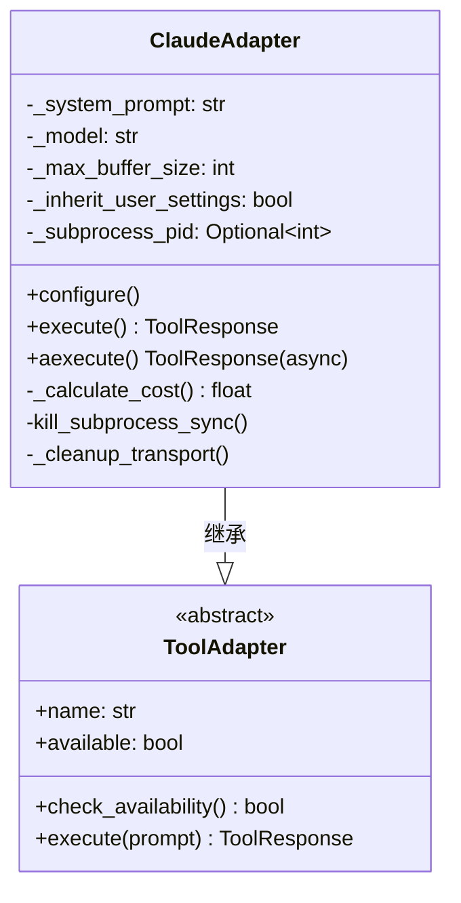
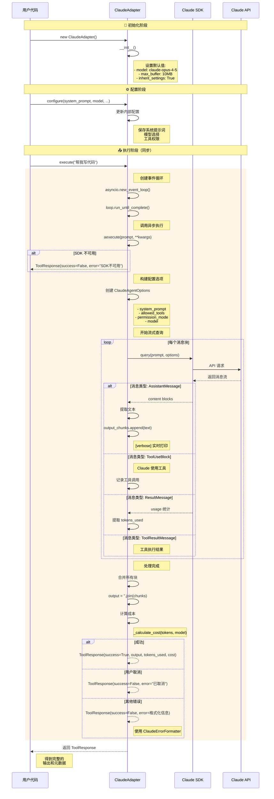
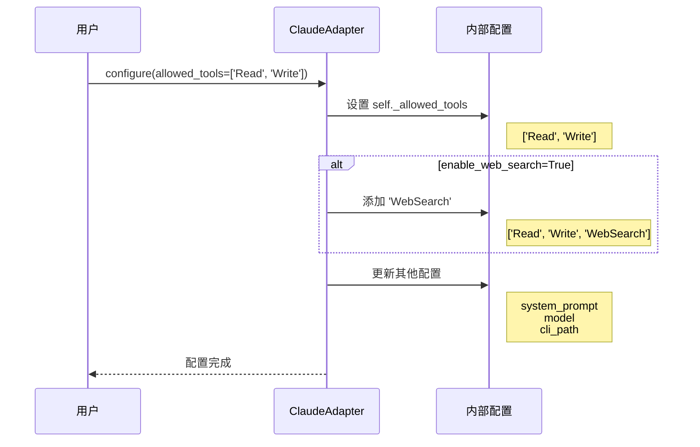
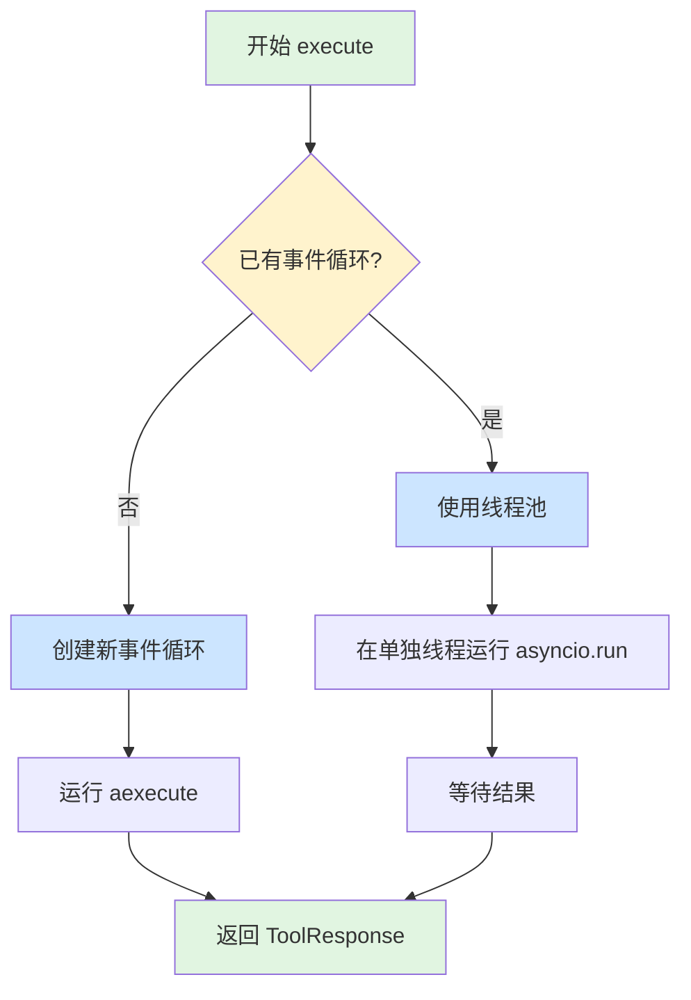
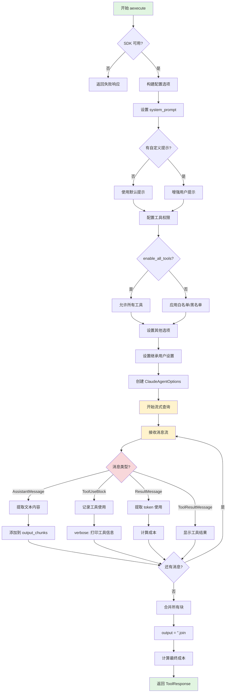
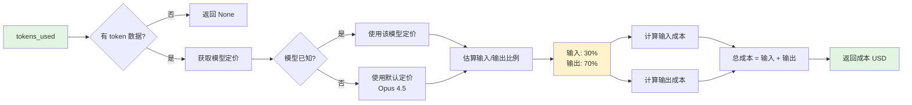
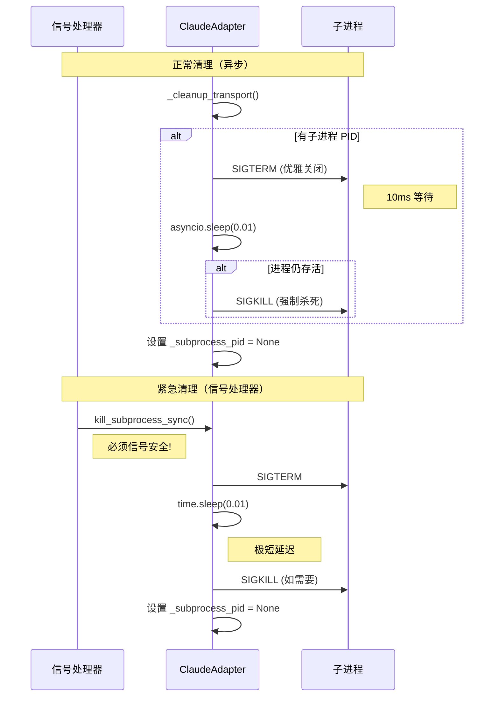
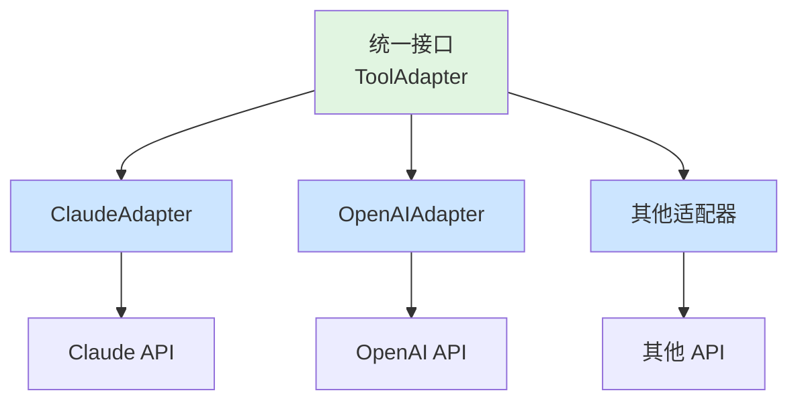

# Claude 适配器详细指南

> **目标读者**: 开发初学者
> **阅读时间**: 20-30 分钟
> **前置知识**: 基础 Python 知识

## 📋 什么是 Claude 适配器？

**ClaudeAdapter** 是一个**适配器类**（Adapter Pattern），用于连接 Ralph Orchestrator 和 Anthropic 的 Claude AI。

### 通俗理解

想象你要用不同国家的电器：
- 中国电器用 220V 电压
- 美国电器用 110V 电压
- **适配器**就是让它们能互相工作的"转换器"

同样，在编程中：
- Ralph Orchestrator 有统一的接口
- Claude API 有特定的调用方式
- **ClaudeAdapter** 就是让它们能互相工作的"翻译器"

---

## 🏗️ 核心架构

### 类继承关系



**关键概念**：
- **ToolAdapter（基类）**: 定义所有工具适配器必须实现的方法
- **ClaudeAdapter（子类）**: 具体实现如何使用 Claude AI

### 主要组成部分

| 组件 | 类型 | 作用 |
|------|------|------|
| `_system_prompt` | 私有属性 | 存储系统提示词 |
| `_model` | 私有属性 | 指定使用的 Claude 模型 |
| `_max_buffer_size` | 私有属性 | 最大缓冲区大小（默认 10MB） |
| `_inherit_user_settings` | 私有属性 | 是否继承用户的 Claude Code 设置 |
| `_subprocess_pid` | 私有属性 | 子进程进程 ID（用于清理） |

---

## 🔄 完整工作流程时序图

### 从初始化到返回结果的全过程



---

## 📖 关键方法详解

### 1️⃣ `__init__()` - 初始化方法

#### 代码位置
[claude.py:44-54](../../src/ralph_orchestrator/adapters/claude.py#L44-L54)

#### 方法签名
```python
def __init__(
    self,
    verbose: bool = False,
    max_buffer_size: int = None,
    inherit_user_settings: bool = True,
    cli_path: str = None,
    model: str = None
)
```

#### 参数说明

| 参数 | 类型 | 默认值 | 说明 |
|------|------|--------|------|
| `verbose` | bool | False | 是否打印详细日志 |
| `max_buffer_size` | int | None | 最大缓冲区大小（字节），默认 10MB |
| `inherit_user_settings` | bool | True | 是否继承用户的 Claude Code 设置 |
| `cli_path` | str | None | Claude CLI 路径（通常不需要） |
| `model` | str | None | 模型名称，默认 `claude-opus-4-5` |

#### 作用
创建适配器实例时设置初始配置，这些配置决定了如何与 Claude API 交互。

#### 示例
```python
# 基础用法
adapter = ClaudeAdapter()

# 自定义配置
adapter = ClaudeAdapter(
    verbose=True,          # 打印详细日志
    max_buffer_size=20*1024*1024,  # 20MB
    model="claude-sonnet-4.5"      # 使用 Sonnet 模型
)
```

---

### 2️⃣ `configure()` - 配置方法

#### 代码位置
[claude.py:56-101](../../src/ralph_orchestrator/adapters/claude.py#L56-L101)

#### 方法签名
```python
def configure(
    self,
    system_prompt: Optional[str] = None,
    allowed_tools: Optional[list] = None,
    enable_all_tools: bool = False,
    enable_mcp_tools: bool = False,
    enable_web_search: bool = False,
    model: Optional[str] = None,
    disable_streams: bool = False,
    cli_path: Optional[str] = None,
    system_prompt_suffix: Optional[str] = None
)
```

#### 配置流程时序图



#### 关键参数详解

**工具权限控制**：

```python
# 只允许特定工具
adapter.configure(
    allowed_tools=['Read', 'Write']  # 白名单模式
)

# 允许所有工具
adapter.configure(
    enable_all_tools=True
)

# 启用 MCP 工具（Model Context Protocol）
adapter.configure(
    enable_mcp_tools=True
)
```

**系统提示词增强**：

```python
# 添加系统提示词后缀
adapter.configure(
    system_prompt_suffix="请用中文回答所有问题"
)
```

#### 工具权限逻辑表

| enable_all_tools | allowed_tools | enable_mcp_tools | 结果 |
|-----------------|---------------|------------------|------|
| False | None | False | 所有工具可用 |
| False | ['Read', 'Write'] | False | 只能用 Read, Write |
| True | - | False | 所有工具可用（包括系统工具） |
| False | None | True | 所有工具 + MCP 工具 |

---

### 3️⃣ `execute()` - 同步执行方法

#### 代码位置
[claude.py:103-135](../../src/ralph_orchestrator/adapters/claude.py#L103-L135)

#### 为什么需要这个方法？

**问题**：Claude SDK 是异步的（async），但用户可能想在同步代码中使用

**解决**：`execute()` 提供同步接口，内部处理异步逻辑

#### 执行流程图



#### 线程安全处理

```python
# 检测是否已有事件循环
try:
    loop = asyncio.get_running_loop()
except RuntimeError:
    # 没有事件循环，创建新的
    loop = asyncio.new_event_loop()
    asyncio.set_event_loop(loop)
else:
    # 已有事件循环，使用线程池避免冲突
    with ThreadPoolExecutor() as pool:
        future = pool.submit(lambda: asyncio.run(aexecute(...)))
        return future.result()
```

**为什么这样设计？**
- Python 的 `async` 需要事件循环
- 如果已经在异步环境，用线程池避免冲突
- 给用户一个简单的同步接口

#### 示例
```python
adapter = ClaudeAdapter()
adapter.configure(system_prompt="你是Python专家")

# 简单同步调用
response = adapter.execute("帮我写一个快速排序")

if response.success:
    print(response.output)
    print(f"成本: ${response.cost}")
else:
    print(f"错误: {response.error}")
```

---

### 4️⃣ `aexecute()` - 异步执行方法（核心）

#### 代码位置
[claude.py:137-248](../../src/ralph_orchestrator/adapters/claude.py#L137-L248)

#### 这是最重要的方法！

所有的实际执行逻辑都在这里实现。

#### 完整决策流程图



#### 消息处理时序图

```mermaid
sequenceDiagram
    participant Loop as 消息循环
    participant Msg as 消息处理器
    participant Chunk as output_chunks
    participant Console as 控制台输出

    Loop->>Msg: 收到 AssistantMessage
    Msg->>Msg: 遍历 content blocks

    alt TextBlock
        Msg->>Chunk: append(text)
        Msg->>Console: print_message(text)
    else ToolUseBlock
        Msg->>Console: 打印工具信息
        Note right of Console: 🔧 工具: Read<br/>参数: {file_path: "..."}
    end

    Loop->>Msg: 收到 ResultMessage
    Msg->>Msg: 提取 usage
    Note right of Msg: tokens_used = 1500

    Loop->>Msg: 收到 ToolResultMessage
    Msg->>Console: 显示工具结果
    Note right of Console: ✅ 工具执行成功

    Loop->>Chunk: 合并所有文本
    Chunk-->>Loop: output = "完整内容..."
```

#### 消息类型详解

| 消息类型 | 用途 | 处理方式 |
|---------|------|---------|
| **AssistantMessage** | Claude 的文本响应 | 提取文本，添加到输出 |
| **ToolUseBlock** | Claude 调用工具 | 记录工具名和参数 |
| **ResultMessage** | 包含 token 使用统计 | 提取 tokens_used |
| **ToolResultMessage** | 工具执行结果 | 显示工具执行结果 |

#### 代码示例

```python
async def main():
    adapter = ClaudeAdapter(verbose=True)
    adapter.configure(
        system_prompt="你是Python专家",
        enable_web_search=True
    )

    response = await adapter.aexecute("解释什么是递归")

    if response.success:
        print(f"输出: {response.output}")
        print(f"Token: {response.tokens_used}")
        print(f"成本: ${response.cost}")
    else:
        print(f"错误: {response.error}")

# 运行异步代码
import asyncio
asyncio.run(main())
```

---

## 💰 成本计算详解

### 计算流程图



### 计算公式

```python
# 假设总 token 使用量
tokens_used = 10000

# 估算输入和输出比例（无法精确分离）
input_tokens = tokens_used * 0.3   # 30%
output_tokens = tokens_used * 0.7  # 70%

# 根据模型定价计算
# Opus 4.5: 输入 $5.00/M, 输出 $25.00/M
input_cost = (input_tokens / 1_000_000) * 5.00
output_cost = (output_tokens / 1_000_000) * 25.00

total_cost = input_cost + output_cost
```

### 实际计算示例

```
假设：tokens_used = 10,000, model = claude-opus-4-5

步骤 1: 分配输入/输出比例
├─ 输入 tokens = 10,000 × 0.3 = 3,000
└─ 输出 tokens = 10,000 × 0.7 = 7,000

步骤 2: 查找模型定价（Opus 4.5）
├─ 输入: $5.00 / 1M tokens
└─ 输出: $25.00 / 1M tokens

步骤 3: 计算成本
├─ 输入成本 = (3,000 / 1,000,000) × $5.00 = $0.015
├─ 输出成本 = (7,000 / 1,000,000) × $25.00 = $0.175
└─ 总成本 = $0.015 + $0.175 = $0.19
```

### 模型定价表

| 模型 | 输入成本 (每 1M tokens) | 输出成本 (每 1M tokens) |
|------|------------------------|------------------------|
| claude-opus-4.5 | $5.00 | $25.00 |
| claude-sonnet-4.5 | $3.00 | $15.00 |
| claude-haiku-4.5 | $0.80 | $4.00 |

---

## 🛡️ 错误处理机制

### 错误处理流程图

```mermaid
flowchart TD
    A[执行过程中] --> B{异常类型?}

    B -->|asyncio.TimeoutError| C[超时错误]
    C --> D[ClaudeErrorFormatter<br/>格式化错误]
    D --> E[返回 ToolResponse<br/>success=False]

    B -->|exit code -2| F[用户取消]
    F --> G[返回"已取消"消息]

    B -->|其他 Exception| H[一般错误]
    H --> I[ClaudeErrorFormatter<br/>格式化错误]
    I --> J[记录日志 logger.error]
    J --> K[返回 ToolResponse<br/>success=False]

    style A fill:#e1f5e1
    style E fill:#f8d7da
    style G fill:#f8d7da
    style K fill:#f8d7da
```

### 为什么要用 ClaudeErrorFormatter？

**问题**：不同来源的错误格式不统一，难以理解和处理

**解决**：ClaudeErrorFormatter 统一错误格式，提供友好消息

**好处**：
- ✅ 统一的错误格式
- ✅ 友好的错误消息
- ✅ 包含迭代信息用于重试逻辑
- ✅ 易于调试和日志记录

### 错误类型示例

```python
# 1. 超时错误
try:
    response = await adapter.aexecute("复杂任务")
except asyncio.TimeoutError as e:
    # ClaudeErrorFormatter 会格式化为：
    # "请求超时，请尝试简化任务或增加超时时间"
    pass

# 2. 用户取消（exit code -2）
# 返回：{"success": False, "error": "用户取消了请求"}

# 3. 其他错误
# ClaudeErrorFormatter 会提供：
# - 清晰的错误描述
# - 可能的解决建议
# - 调试信息（迭代次数等）
```

---

## 🧹 子进程管理

### 清理流程时序图



### 为什么有两个清理方法？

| 方法 | 用途 | 特点 |
|------|------|------|
| `kill_subprocess_sync()` | 信号处理器调用 | 必须快速、信号安全 |
| `_cleanup_transport()` | 正常清理时调用 | 可以使用 asyncio |

**信号处理器要求**：
- 必须非常快（避免延迟信号处理）
- 不能使用异步操作
- 必须是信号安全的（reentrant）

**正常清理**：
- 可以使用异步操作
- 可以等待进程优雅关闭
- 更完整的清理逻辑

### 清理策略

```python
# 两阶段关闭
1. SIGTERM (优雅关闭)
   ↓
   等待 10ms 让进程清理资源
   ↓
2. 如果进程仍存活，SIGKILL (强制杀死)
```

**为什么先用 SIGTERM？**
- 允许进程保存状态、关闭连接
- 更优雅，避免资源泄漏
- SIGKILL 作为最后手段

---

## 🎯 关键设计模式

### 1. 适配器模式 (Adapter Pattern)



**好处**：
- ✅ 统一的接口，易于切换
- ✅ 隔离变化，降低耦合
- ✅ 符合开闭原则（对扩展开放，对修改关闭）

### 2. 建造者模式 (Builder Pattern)

```python
# 构建复杂配置对象
options = ClaudeAgentOptions(
    system_prompt="你是Python专家",
    allowed_tools=['Read', 'Write'],
    permission_mode='basic',
    model="claude-opus-4.5"
)
```

**好处**：
- ✅ 清晰的参数组织
- ✅ 易于扩展新参数
- ✅ 类型安全

### 3. 策略模式 (Strategy Pattern)

```python
# 不同的错误处理策略
try:
    # 执行逻辑
except asyncio.TimeoutError:
    # 策略 1: 超时处理
except ExitCodeError(-2):
    # 策略 2: 用户取消
except Exception:
    # 策略 3: 通用处理
```

**好处**：
- ✅ 针对不同情况使用不同策略
- ✅ 易于添加新的错误类型
- ✅ 代码清晰，职责分明

---

## 📝 完整使用示例

### 示例 1：基础使用

```python
from ralph_orchestrator.adapters.claude import ClaudeAdapter

# 1. 创建适配器
adapter = ClaudeAdapter(verbose=True)

# 2. 配置
adapter.configure(
    system_prompt="你是Python编程专家",
    model="claude-opus-4-5"
)

# 3. 执行
response = adapter.execute("帮我写一个快速排序算法")

# 4. 检查结果
if response.success:
    print(response.output)
    print(f"Token 使用: {response.tokens_used}")
    print(f"成本: ${response.cost:.4f}")
else:
    print(f"错误: {response.error}")
```

### 示例 2：工具权限控制

```python
# 只允许文件读写工具
adapter = ClaudeAdapter()
adapter.configure(
    allowed_tools=['Read', 'Write'],
    system_prompt="你是一个文件编辑助手"
)

response = adapter.execute("读取 config.json 并修改端口")
```

### 示例 3：启用 Web 搜索

```python
# 允许 Claude 使用网络搜索
adapter = ClaudeAdapter()
adapter.configure(
    enable_web_search=True,
    system_prompt="你可以搜索最新信息"
)

response = adapter.execute("最新的 Python 版本是多少？")
```

### 示例 4：异步使用

```python
import asyncio

async def main():
    adapter = ClaudeAdapter(verbose=True)
    adapter.configure(
        system_prompt="你是数据分析专家"
    )

    # 异步执行
    response = await adapter.aexecute(
        "分析这组数据: [1,2,3,4,5,6,7,8,9,10]"
    )

    if response.success:
        print(response.output)
        print(f"成本: ${response.cost}")

asyncio.run(main())
```

### 示例 5：批量处理

```python
adapter = ClaudeAdapter()
adapter.configure()

tasks = [
    "解释什么是递归",
    "如何优化 Python 代码",
    "什么是设计模式"
]

results = []
for task in tasks:
    response = adapter.execute(task)
    results.append(response)
    print(f"任务: {task[:20]}... | 成本: ${response.cost:.4f}")

# 计算总成本
total_cost = sum(r.cost for r in results if r.cost)
print(f"总成本: ${total_cost:.4f}")
```

---

## 🔍 关键要点总结

### 核心概念

1. **适配器模式**: 统一接口，隔离实现
2. **异步转同步**: `execute()` 提供简单的同步接口
3. **流式处理**: `aexecute()` 逐块接收和处理消息
4. **类型判断**: 根据消息类型分别处理（文本、工具、结果）
5. **成本追踪**: 自动计算 API 使用成本
6. **错误格式化**: 统一友好的错误消息
7. **进程管理**: 安全的子进程创建和清理

### 最佳实践

✅ **推荐做法**：
- 使用 `configure()` 明确配置工具权限
- 启用 `verbose=True` 调试时查看详细日志
- 监控 `tokens_used` 和 `cost` 控制成本
- 使用异步 `aexecute()` 处理并发请求
- 适当设置 `max_buffer_size` 处理大文件

❌ **避免做法**：
- 不要在生产环境启用 `verbose=True`
- 不要允许所有工具（`enable_all_tools=True`）除非必要
- 不要忽略 `response.success` 检查
- 不要在信号处理器中使用异步操作

### 性能优化提示

| 优化项 | 说明 |
|--------|------|
| 模型选择 | 简单任务用 Haiku，复杂任务用 Opus |
| Token 控制 | 清晰的提示词减少不必要的消耗 |
| 批量处理 | 多个任务合并到一个请求减少开销 |
| 缓存结果 | 避免重复请求相同内容 |

---

## 📚 延伸阅读

### 相关文档

- [Claude SDK 文档](https://docs.anthropic.com/claude-reference/)
- [Agent 通信协议](../advanced/loop-detection.md)
- [成本管理指南](cost-management.zh.md)
- [监控和指标](../advanced/monitoring.md)

### 代码位置

- **ClaudeAdapter 实现**: [src/ralph_orchestrator/adapters/claude.py](../../src/ralph_orchestrator/adapters/claude.py)
- **基础适配器**: [src/ralph_orchestrator/adapters/base.py](../../src/ralph_orchestrator/adapters/base.py)
- **错误格式化**: [src/ralph_orchestrator/utils/errors.py](../../src/ralph_orchestrator/utils/errors.py)

---

## ❓ 常见问题

### Q1: 为什么需要适配器模式？

**答**: 适配器模式让我们能够：
- 统一不同 AI 提供商的接口
- 轻松切换或添加新的 AI 服务
- 隔离外部 API 变化对核心代码的影响

### Q2: 同步和异步方法有什么区别？

**答**:
- **`execute()`**: 同步方法，简单直接，适合单次调用
- **`aexecute()`**: 异步方法，更高效，适合批量或并发处理

### Q3: 如何控制成本？

**答**:
1. 选择合适的模型（Haiku < Sonnet < Opus）
2. 优化提示词，减少 token 消耗
3. 监控 `tokens_used` 和 `cost` 字段
4. 考虑缓存常见问题的答案

### Q4: 为什么要继承用户设置？

**答**:
继承用户的 Claude Code 设置（MCP 服务器、CLAUDE.md 等）让 AI 能够：
- 使用用户自定义的工具
- 遵循项目的编码规范
- 访问项目的文档和上下文

### Q5: 如何调试工具调用？

**答**:
```python
# 启用详细日志
adapter = ClaudeAdapter(verbose=True)

# 查看工具使用情况
response = adapter.execute("...")
# verbose 模式会打印所有工具调用
```

---

**祝你学习愉快！** 🎓

如有任何疑问，欢迎查阅源代码或提交 Issue。
