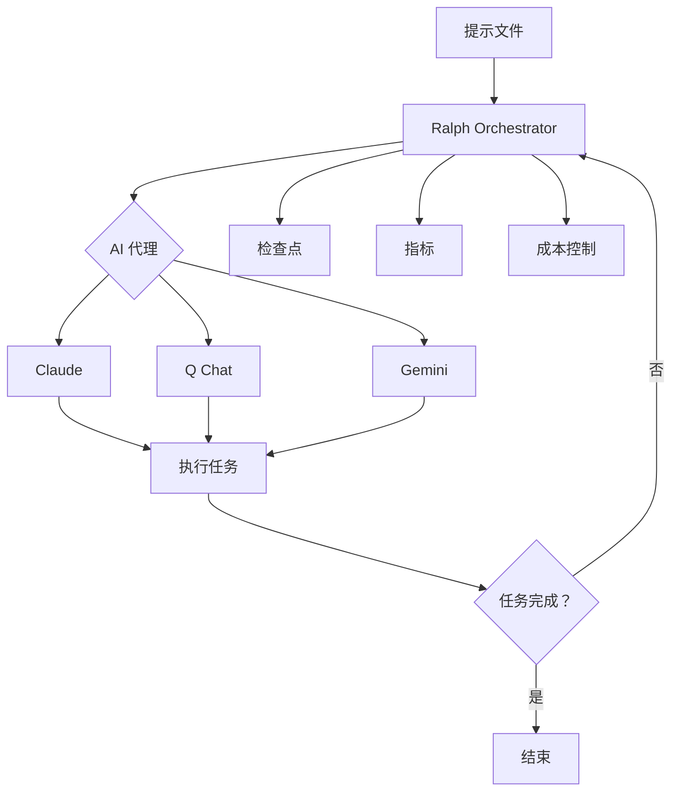
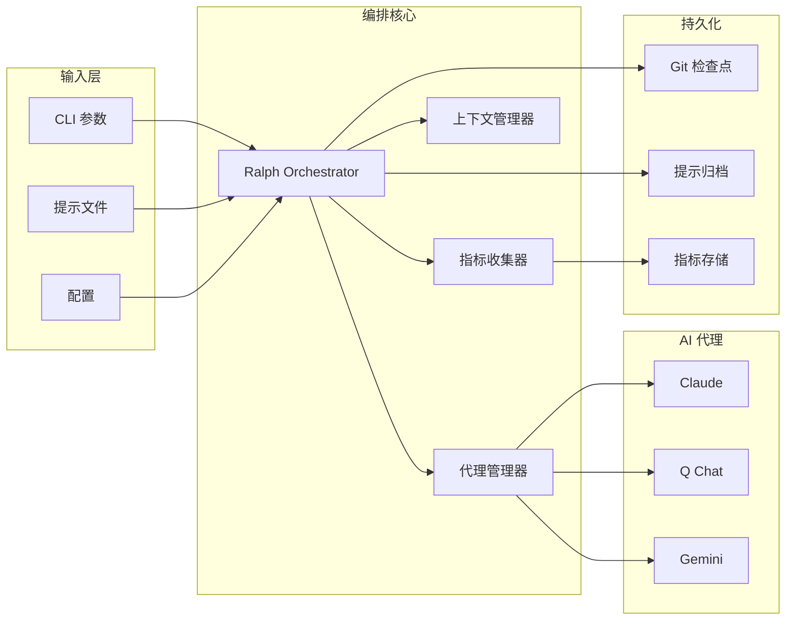

# 概述

## Ralph Orchestrator 是什么？

Ralph Orchestrator 是 Ralph Wiggum 编排技术的生产就绪实现，用于 AI 代理。它提供了一个健壮的框架，用于持续运行 AI 代理循环直到任务完成，具有企业级的安全性、监控和成本控制。

该系统以《辛普森一家》中的 Ralph Wiggum 命名，体现了持续迭代的理念："我英语挂科？那是不可能的！"——只要不断尝试直到成功。

## 关键概念

### Ralph Wiggum 技术

其核心是，正如 [Geoffrey Huntley](https://ghuntley.com/ralph/) 最初定义的那样：**"Ralph 是一个 Bash 循环。"**

```bash
while :; do cat PROMPT.md | claude ; done
```

这种简单而强大的 AI 编排方法在"不可预测的世界中确定性地糟糕"——它以可预测的方式失败，但您可以解决这些问题。该技术需要"对最终一致性的信念和信任"，通过迭代调优不断改进。

工作流程很简单：

1. **给 AI 一个任务**通过提示文件 (PROMPT.md)
2. **让它持续迭代**解决问题
3. **监控进度**通过检查点和指标
4. **在完成时或达到限制时停止**

这种方法利用了 AI 通过多次迭代自我纠正和改进的能力，通过预先定义成功标准而不是逐步指导，颠覆了典型的 AI 工作流程。

### 增强实现：Claude Code 插件

官方的 [ralph-wiggum 插件](https://github.com/anthropics/claude-code/tree/main/plugins/ralph-wiggum) 为 Claude Code 扩展了基本技术，具有：

- **停止钩子机制**：拦截退出代码 2 以重新注入提示并继续迭代
- **迭代限制**：防止无限循环的主要安全机制
- **完成承诺**：可选的字符串匹配以检测任务完成
- **完整上下文保留**：每个周期都可以访问之前运行的修改文件和 git 历史

**可用命令：**

| 命令 | 描述 |
| ------------------------ | --------------------------------------------------------- |
| `/ralph-loop "<prompt>"` | 使用可选的 `--max-iterations` 启动自主循环 |
| `/cancel-ralph` | 停止活动的 Ralph 循环 |
| `/help` | 显示插件帮助和文档 |

有关详细的 Claude Code 集成，请参见 [paddo.dev/blog/ralph-wiggum-autonomous-loops](https://paddo.dev/blog/ralph-wiggum-autonomous-loops/)。

### 核心组件



!!! warning "成本意识"
自主循环消耗大量令牌。**大型代码库上 50 次迭代循环可能在 API 积分上花费 50-100 美元以上**，很快就会耗尽订阅限制。始终设置迭代限制并仔细监控成本。参见[成本管理](cost-management.md)了解策略。

## 工作原理

### 1. 初始化阶段

当您启动 Ralph Orchestrator 时，它会：

- 验证提示文件的安全性
- 检测可用的 AI 代理
- 设置监控和指标收集
- 创建工作目录用于检查点
- 初始化成本和令牌跟踪

### 2. 迭代循环

主要的编排循环：

1. **飞行前检查**：验证令牌/成本限制未超出
2. **上下文管理**：检查是否需要总结上下文窗口
3. **代理执行**：使用提示运行选定的 AI 代理
4. **响应处理**：捕获和分析代理的输出
5. **指标收集**：跟踪令牌、成本和性能
6. **进度评估**：监控目标进展
7. **检查点**：在配置的间隔保存状态
8. **重复**：继续直到任务完成或达到限制

### 3. 安全机制

多层保护确保安全操作：

```
                                 🛡️ 五种安全机制

  ┌───────────────────┐     ┌───────────────────┐     ┌───────────────────┐
  │  迭代限制  │     │   运行时间限制   │     │    成本限制     │
  │ （默认：100）    │     │   （默认：4小时）  │     │   （默认：$10）  │
  └───────────────────┘     └───────────────────┘     └───────────────────┘
            │                         │                         │
            │                         │                         │
            ∨                         ∨                         ∨
          ╔═══════════════════════════════════════════════════════╗
          ║                SafetyGuard.check()                ║
          ╚═══════════════════════════════════════════════════════╝
            ∧                         ∧                         ∧
            │                         │                         │
            │                         │                         │
  ┌───────────────────┐     ┌───────────────────┐     ┌───────────────────┐
  │  连续失败限制  │     │   循环检测   │     │ 完成标记 │
  │   （默认：5）    │     │  （90% 相似）   │     │ [x] TASK_COMPLETE │
  └───────────────────┘     └───────────────────┘     └───────────────────┘
```

<details>
<summary>graph-easy 源代码</summary>

```
graph { label: "🛡️ 五种安全机制"; flow: south; }
[ 迭代限制 （默认：100） ] -> [ SafetyGuard.check() ] { border: double; }
[ 运行时间限制 （默认：4小时） ] -> [ SafetyGuard.check() ]
[ 成本限制 （默认：$10） ] -> [ SafetyGuard.check() ]
[ 连续失败限制 （默认：5） ] -> [ SafetyGuard.check() ]
[ 循环检测 （90% 相似） ] -> [ SafetyGuard.check() ]
[ 完成标记 [x] TASK_COMPLETE ] -> [ SafetyGuard.check() ]
```

</details>

- **输入验证**：清理提示以防止注入攻击
- **资源限制**：强制执行迭代、运行时间和成本边界
- **完成标记**：在提示文件中检测到 `- [x] TASK_COMPLETE` 时提前退出
- **循环检测**：当代理输出与最近历史记录 ≥90% 相似时停止
- **连续失败限制**：重复失败后停止（默认：5）
- **上下文溢出**：接近限制时自动总结
- **优雅关闭**：处理中断并保存状态
- **错误恢复**：使用指数退避重试

参见[循环检测](../advanced/loop-detection.md)了解有关输出相似性检测的详细文档。

### 4. 完成

当任务完成或达到限制时：

- 保存最终指标
- 状态持久化以供分析
- 报告使用统计信息
- 导出详细日志

## 使用场景

Ralph Orchestrator 擅长：

### 最佳使用场景

- **大型重构**：框架迁移、依赖项升级
- **批处理操作**：文档生成、代码标准化
- **测试覆盖率扩展**：生成综合测试套件
- **绿地项目脚手架**：新项目设置和样板代码

### 不推荐用于

- 缺乏明确完成标准的模糊需求
- 需要人类推理的架构决策
- 安全敏感代码（身份验证、支付）
- 需要人类好奇心的探索性工作

!!! info "实际结果（2024-2025）"
该技术已在规模上证明有效：

    - **Y Combinator 黑客马拉松**：团队使用 Ralph 循环在一夜之间交付了 6 个仓库
    - **合同 MVP**：一名工程师以 **297 美元**的 API 成本完成了 50,000 美元的合同
    - **语言开发**：Geoffrey Huntley 的 3 个月循环创建了一个完整的深奥编程语言（CURSED）——AI 成功地用它发明的语言编程，该语言不存在于任何训练数据中

    这些结果表明，通过清晰的提示和耐心，Ralph 可以替代新项目的实质性外包工作。

### 软件开发

- 根据规范编写完整的应用程序
- 重构大型代码库
- 迭代实现复杂功能
- 调试困难问题

### 内容创建

- 编写综合文档
- 生成测试套件
- 创建 API 规范
- 开发培训材料

### 数据处理

- 分析大型数据集
- 生成报告
- 数据转换管道
- ETL 操作

### 研究与分析

- 文献综述
- 市场研究
- 竞争分析
- 技术调查

## 优势

### 🚀 生产力

- 自动化复杂的多步骤任务
- 减少人工干预
- 跨多个代理并行工作
- 24/7 运行能力

### 💰 成本管理

- 实时成本跟踪
- 可配置的支出限制
- 每代理定价模型
- 令牌使用优化

### 🔒 安全性

- 输入清理
- 命令注入预防
- 路径遍历保护
- 审计跟踪

### 📊 可观察性

- 详细的指标收集
- 性能监控
- 成功/失败跟踪
- 资源利用率

### 🔄 可靠性

- 自动重试
- 状态持久化
- 检查点恢复
- 优雅降级

## 架构概述



## 入门

要开始使用 Ralph Orchestrator：

1. **安装工具**和至少一个 AI 代理
2. **创建提示文件**包含您的任务
3. **使用适当的限制运行编排器**
4. **通过日志和指标监控进度**
5. **在完成时检索结果**

参见[快速开始](../quick-start.md)指南了解详细说明。

## 后续步骤

- 了解[配置](configuration.md)选项
- 了解[代理](agents.md)选择和功能
- 掌握[提示](prompts.md)工程以获得最佳结果
- 探索[成本管理](cost-management.md)策略
- 设置[检查点](checkpointing.md)以进行恢复